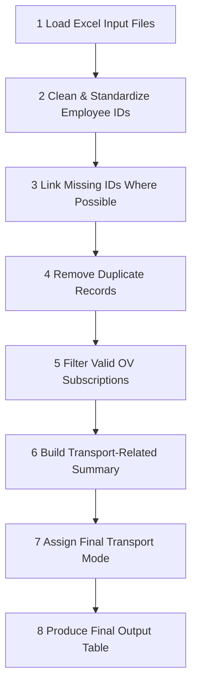
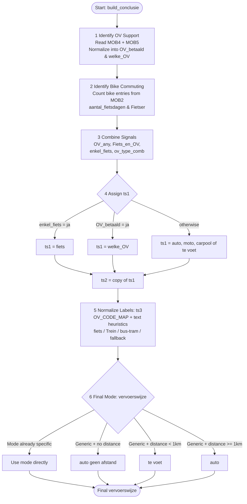

# UGent Mobility Backend

This project processes UGent employee mobility data from several Excel sheets and distance reference files. Its purpose is to turn raw HR and mobility input into a structured report that shows how employees commute, which mobility benefits they receive, and how transport is classified for reporting.

## Project Structure

The system is split into two main components:

| Component | File | Purpose |
|-----------|------|---------|
| **Backend** | `ugent_mobility_backend_fixed.py` | Contains the mobility business logic, data cleaning, ID linking, deduplication, OV/bike prioritization, and final transport mode assignment. |
| **Frontend** | `MobilityApp2026.py` | Tkinter-based GUI for loading Excel files, mapping columns, running the analysis, previewing results, and exporting output. |

The main logic is implemented in `ugent_mobility_backend_fixed.py`, especially in the `build_conclusie()` step, where the final transport mode is assigned.

## Build / Distribution

The app is packaged as a standalone Windows executable using PyInstaller. The build command used is:

```powershell
pyinstaller --onefile --windowed --name="MobilityTool" --add-data="ugent_mobility_backend_fixed.py;." --hidden-import=openpyxl --hidden-import=pandas MobilityApp2026.py
```

---

## What This Project Does

The workflow is divided into clear stages:



The final result is a person-level summary with fields such as:
- Bike commuting frequency
- OV subscription status
- Transport mode
- Email and home location information
- Distance-based classifications

---

## How Transport Mode Is Assigned

The transport assignment follows a simple business rule:

- If a person has a formal OV subscription, that OV mode is treated as the **primary** transport mode.
- Bike commuting is considered only when there is **no** OV subscription.
- If neither is available, the system falls back to **distance-based logic**.

This makes the logic easy to understand:
1. OV is the preferred signal for primary mode
2. Bike is a secondary signal
3. Distance is only a fallback

---

## Priority Logic

The code uses two layers of priority.

### 1. OV vs Bike

If a person has both bike use and OV support, **OV wins**.

**Why?**
- OV subscriptions represent formal employer-supported mobility benefits.
- They are treated as stronger evidence of the intended commute mode.
- Bike commuting may be additional or occasional, but it is not treated as the main mode when OV exists.

**Result:**
- `enkel_fiets = "ja"` only when the person bikes but has no OV subscription.
- `Fiets_en_OV = "ja"` when both bike and OV exist, meaning OV dominates the final assignment.

### 2. Priority Within OV Types

If a person has more than one OV-related category, the highest-priority type is selected.

**Priority order:**

| Rank | Type |
|------|------|
| 1 | `Trein` — highest priority |
| 2 | `bus/tram` |
| 3 | `fiets` |
| 4 | Generic fallback values (`auto, moto, carpool of te voet`) |
| 5 | Empty values |

This is implemented through `OV_PRIORITY` and the sorting step in the combination logic.

---

## Step-by-Step Logic



### 1. Identify OV Support

The system reads OV-related information from:
- `MOB4` for subscriptions
- `MOB5` for absence/transport-related entries

These values are normalized and combined into a single transport type per employee.

**Fields created here:**
- `OV_betaald` → whether OV support exists
- `welke_OV` → the selected OV type

### 2. Identify Bike Commuting

The system counts bike-related entries from `MOB2`.

**Fields created here:**
- `aantal_fietsdagen` → number of bike days found
- `Fietser` → whether the threshold for biking is met

### 3. Combine the Signals

The logic then creates decision flags:
- `OV_any` → person has OV support
- `Fiets_en_OV` → person has both bike and OV
- `enkel_fiets` → person bikes but has no OV
- `ov_type_comb` → combined transport type when OV exists

### 4. Assign the First Transport Label (`ts1` / `ts2`)

The first transport label is assigned as follows:
- If `enkel_fiets == "ja"` → `ts1 = "fiets"`
- Else if `OV_betaald == "ja"` → `ts1 = welke_OV`
- Otherwise → `ts1 = "auto, moto, carpool of te voet"`

`ts2` is simply copied from `ts1`.

### 5. Normalize the Labels (`ts3`)

The labels are standardized into clearer categories:
- `fiets`
- `Trein`
- `bus/tram`
- generic fallback values

This is done through `OV_CODE_MAP` and simple text-based heuristics.

### 6. Final Transport Mode (`vervoerswijze`)

The final mode is assigned as follows:
- If the normalized mode is already specific, use it directly.
- If the mode is still generic and distance is missing, use `auto (geen afstand)`.
- If the mode is generic and distance is below 1 km, use `te voet`.
- Otherwise, use `auto`.

---

## Examples

| Situation | Final Result |
|---|---|
| Has train subscription | `Trein` |
| Has bus/tram subscription | `bus/tram` |
| Bikes regularly but has no OV | `fiets` |
| Bikes and also has train OV | `Trein` |
| No bike and no OV | distance-based fallback |

---

## Summary

The logic is intentionally simple and transparent:
- OV support is treated as the strongest sign of primary transport mode.
- Bike use is only the main mode when no OV support exists.
- Distance is only a fallback when no better signal is available.

This makes the output suitable for HR reporting, mobility analysis, and trend monitoring.
